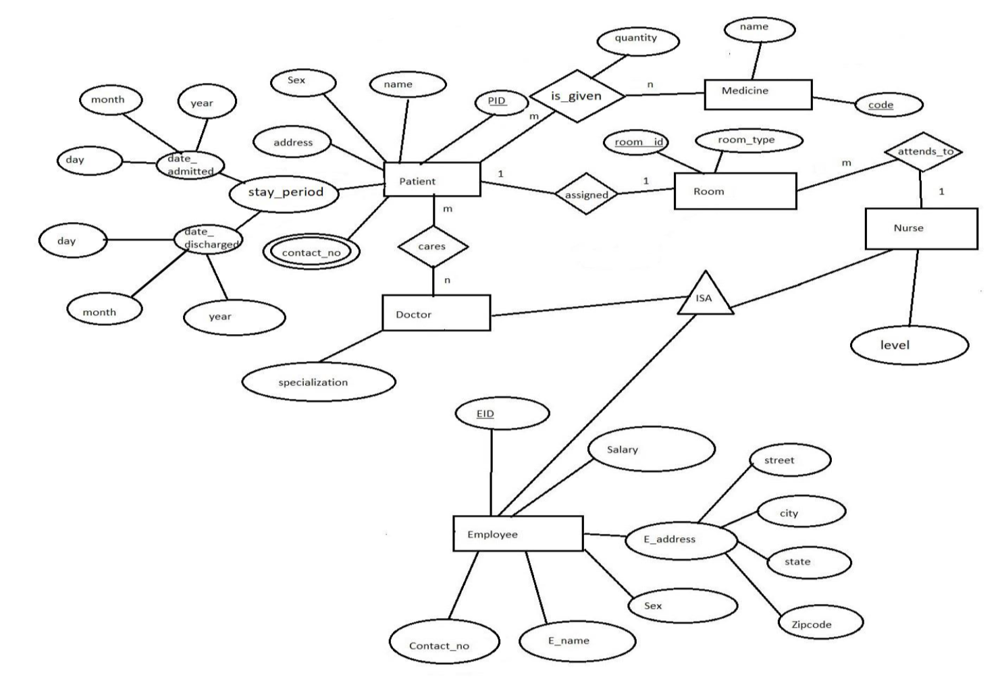
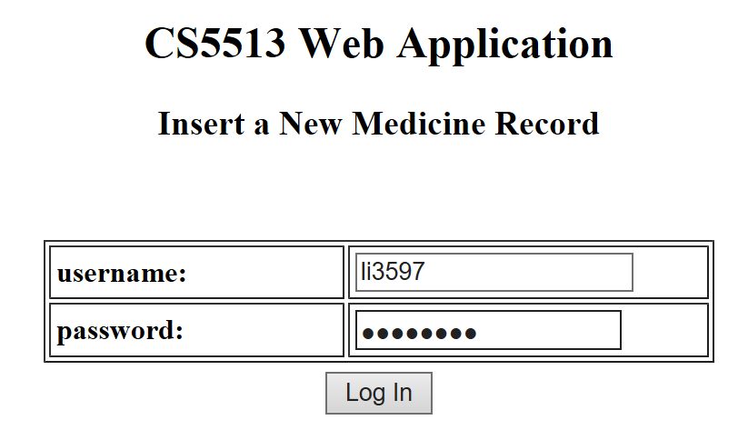
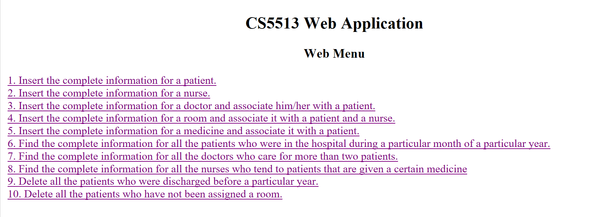
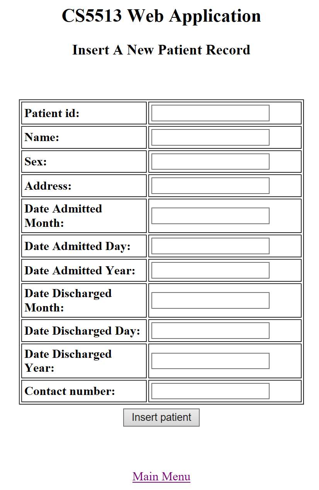
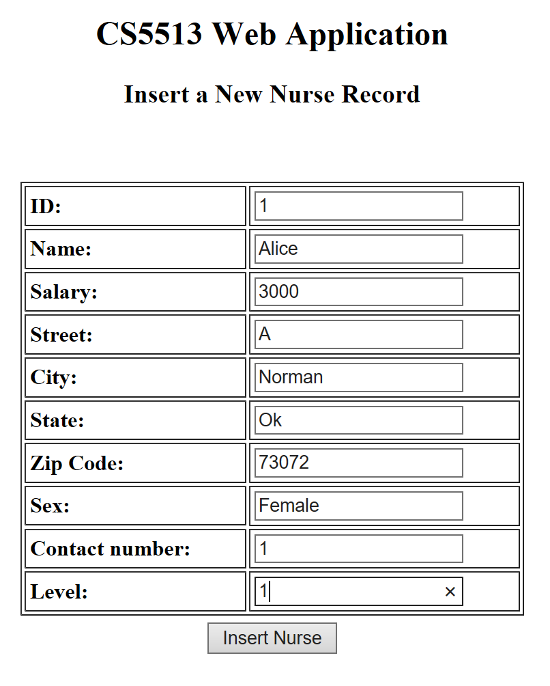
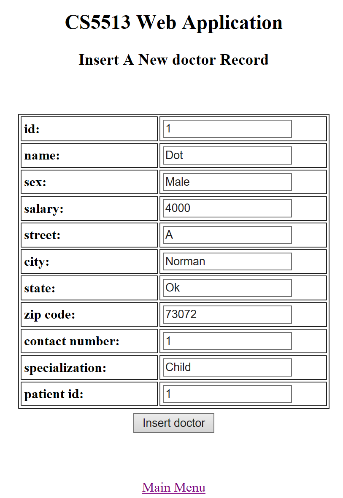

# Hospital database application

Implement the hostital database application based on the digram and queries.

Queries:

1) Insert the complete information for a patient.
2) Insert the complete information for a nurse.
3) Insert the complete information for a doctor and associate him/her with a patient.
4) Insert the complete information for a room and associate it with a patient and a nurse.
5) Insert the complete information for a medicine and associate it with a patient.
6) Find the complete information for all the patients who were in the hospital during a particular month of a particular year (e.g. during July of 2017).
7) Find the complete information for all the doctors who care for more than two patients.
8) Find the complete information for all the nurses who tend to patients that are given a certain medicine (e.g. medicine code: 123).
9) Delete all the patients who were discharged before a particular year.
10) Delete all the patients who have not been assigned a room.

## Usage

- Drop the type and table using `dropTypeAndTable.sql`
- Create the type and table using `createTypeAndTable.sql`
- Run Java Program using `DataHandler.java`
- Execute corresponding queries

## Test cases

Login Web Page:

Menu Page:

Query Page 1:

Query Page 2:

Query Page 3:

